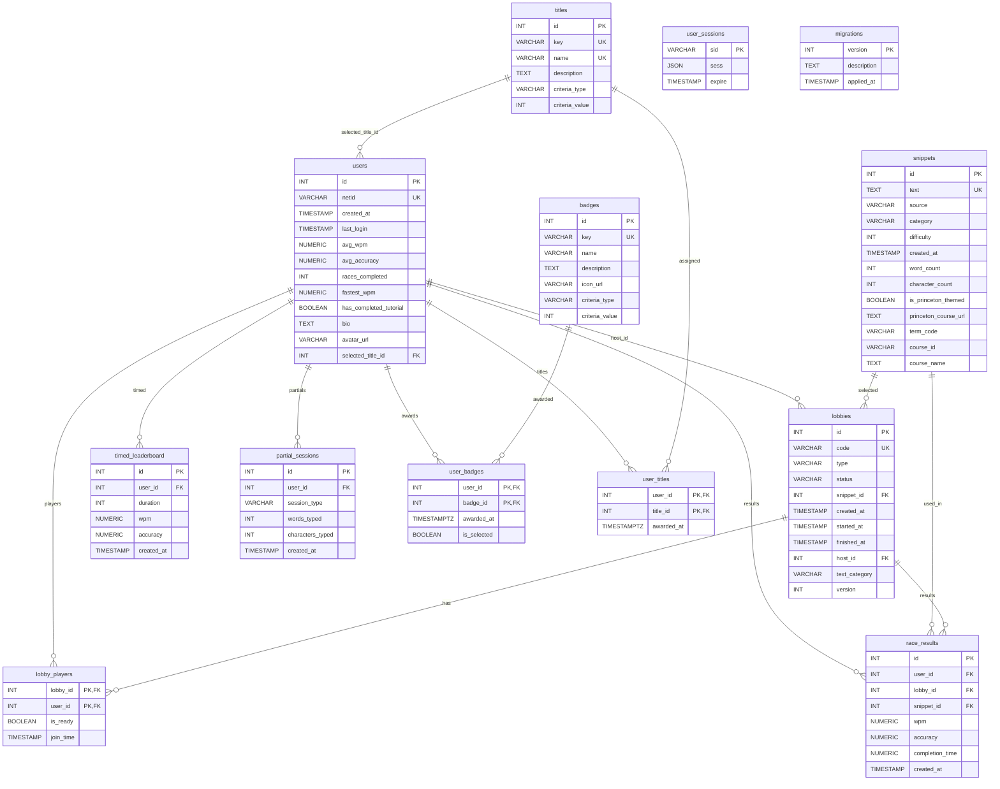

# Database Schema (Live Introspection)

This document reflects the current Postgres schema from the configured database (information_schema and pg_catalog queries). It lists all tables, columns, constraints, and relationships, and includes a Mermaid ER diagram.

Notes
- The live DB includes pg_stat_statements tables in public (extension).
- At the time of introspection, `lobbies.snippet_id` and `race_results.snippet_id` use `ON DELETE NO ACTION`. Migration 18 (added in this repo) changes both to `ON DELETE SET NULL` for safer snippet deletion.

## Tables

### users
- id integer PK
- netid varchar UNIQUE NOT NULL
- created_at timestamp DEFAULT CURRENT_TIMESTAMP
- last_login timestamp DEFAULT CURRENT_TIMESTAMP
- avg_wpm numeric DEFAULT 0
- avg_accuracy numeric DEFAULT 0
- races_completed integer DEFAULT 0
- fastest_wpm numeric DEFAULT 0
- has_completed_tutorial boolean DEFAULT false
- bio text NULL
- avatar_url varchar NULL
- selected_title_id integer FK → titles.id ON DELETE SET NULL

### snippets
- id integer PK
- text text UNIQUE NOT NULL
- source varchar NULL
- category varchar NULL
- difficulty integer DEFAULT 1
- created_at timestamp DEFAULT CURRENT_TIMESTAMP
- word_count integer NULL
- character_count integer NULL
- is_princeton_themed boolean DEFAULT false
- princeton_course_url text NULL
- term_code varchar NULL
- course_id varchar NULL
- course_name text NULL

### lobbies
- id integer PK
- code varchar UNIQUE NOT NULL
- type varchar CHECK in ('public','private','practice') NOT NULL
- status varchar CHECK in ('waiting','countdown','racing','finished') NOT NULL
- snippet_id integer FK → snippets.id (currently NO ACTION; migration 18 sets to SET NULL)
- created_at timestamp DEFAULT CURRENT_TIMESTAMP
- started_at timestamp NULL
- finished_at timestamp NULL
- host_id integer FK → users.id
- text_category varchar DEFAULT 'general'
- version integer NOT NULL DEFAULT 0

### lobby_players
- lobby_id integer FK → lobbies.id ON DELETE CASCADE
- user_id integer FK → users.id ON DELETE CASCADE
- is_ready boolean DEFAULT false
- join_time timestamp DEFAULT CURRENT_TIMESTAMP
- PRIMARY KEY (lobby_id, user_id)

### race_results
- id integer PK
- user_id integer FK → users.id
- lobby_id integer FK → lobbies.id
- snippet_id integer FK → snippets.id (currently NO ACTION; migration 18 sets to SET NULL)
- wpm numeric NULL
- accuracy numeric NULL
- completion_time numeric NULL
- created_at timestamp DEFAULT CURRENT_TIMESTAMP

### timed_leaderboard
- id integer PK
- user_id integer FK → users.id ON DELETE CASCADE
- duration integer CHECK IN (15,30,60,120) NOT NULL
- wpm numeric NOT NULL
- accuracy numeric NOT NULL
- created_at timestamp DEFAULT CURRENT_TIMESTAMP

### partial_sessions
- id integer PK
- user_id integer FK → users.id ON DELETE CASCADE
- session_type varchar NOT NULL ('snippet' or 'timed')
- words_typed integer NOT NULL
- characters_typed integer NOT NULL
- created_at timestamp DEFAULT CURRENT_TIMESTAMP

### badges
- id integer PK
- key varchar UNIQUE NOT NULL
- name varchar NOT NULL
- description text NULL
- icon_url varchar NULL
- criteria_type varchar NOT NULL
- criteria_value integer NOT NULL

### user_badges
- user_id integer FK → users.id ON DELETE CASCADE
- badge_id integer FK → badges.id ON DELETE CASCADE
- awarded_at timestamptz DEFAULT now()
- is_selected boolean DEFAULT false
- PRIMARY KEY (user_id, badge_id)

### titles
- id integer PK
- key varchar UNIQUE NOT NULL
- name varchar UNIQUE NOT NULL
- description text NULL
- criteria_type varchar NOT NULL
- criteria_value integer NOT NULL

### user_titles
- user_id integer FK → users.id ON DELETE CASCADE
- title_id integer FK → titles.id ON DELETE CASCADE
- awarded_at timestamptz DEFAULT now()
- PRIMARY KEY (user_id, title_id)

### user_sessions
- sid varchar PK
- sess json NOT NULL
- expire timestamp NOT NULL

### migrations
- version integer PK
- description text NOT NULL
- applied_at timestamp DEFAULT CURRENT_TIMESTAMP

### pg_stat_statements (extension)
- pg_stat_statements, pg_stat_statements_info exist in public.

## Foreign Keys (current rules)
- lobbies.host_id → users.id (NO ACTION)
- lobbies.snippet_id → snippets.id (NO ACTION; migration 18 will make SET NULL)
- lobby_players.lobby_id → lobbies.id (ON DELETE CASCADE)
- lobby_players.user_id → users.id (ON DELETE CASCADE)
- partial_sessions.user_id → users.id (ON DELETE CASCADE)
- race_results.lobby_id → lobbies.id (NO ACTION)
- race_results.snippet_id → snippets.id (NO ACTION; migration 18 will make SET NULL)
- race_results.user_id → users.id (NO ACTION)
- timed_leaderboard.user_id → users.id (ON DELETE CASCADE)
- user_badges.user_id → users.id (ON DELETE CASCADE)
- user_badges.badge_id → badges.id (ON DELETE CASCADE)
- user_titles.user_id → users.id (ON DELETE CASCADE)
- user_titles.title_id → titles.id (ON DELETE CASCADE)
- users.selected_title_id → titles.id (ON DELETE SET NULL)

## Mermaid ER Diagram

Tip: After applying Migration 18, the relationships from snippets to lobbies and race_results effectively behave as optional (SET NULL on delete), which matches the open circle cardinality shown here.

